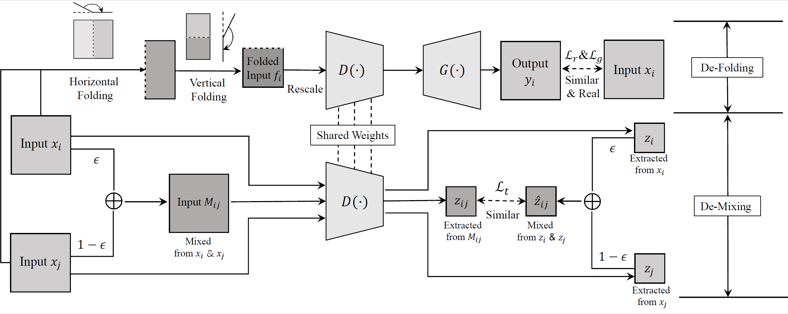

# Taming Self-Supervised Learning for Presentation Attack Detection: De-Folding and De-Mixing
  This is an official pytorch implementation of 'Taming Self-Supervised Learning for Presentation Attack Detection: De-Folding and De-Mixing', which is accepted by IEEE Transactions on Neural Networks and learning systems.
  [[Paper](https://ieeexplore.ieee.org/abstract/document/10051654)]
  [[arxiv](https://arxiv.org/abs/2109.04100)]
  
  

## Requirements

- python 3.6
- pytorch 1.1.0
- torchvision 0.3.0
- numpy 1.19.5
- pandas 0.25.3

## Pre-processing

### Face

- Dataset

  Download the OULU-NPU(O), CASIA-FASD(C), Idiap Replay-Attack(I) and MSU-MFSD(M) datasets.

- Face alignment

  [MTCNN algotithm](https://github.com/YYuanAnyVision/mxnet_mtcnn_face_detection) is utilized for face detection/alignment.

- Data Label Generation

  Move to the `$root/face` and generate the data label list:

  ```
  python data_find.py --data_path dataPath
  ```

  `dataPath` is the path of data.

### Fingerprint

- Dataset

  Download the LivDet 2017 datasets.

- Data Label Generation

  Move to the `$root/fingerprint` and generate the label:

  ```
    python data_find.py --data_path dataPath
  ```

  `dataPath` is the path of data.

## Usage

- Move to the `$root/face` or `$root/fingerprint` and run pretext task:

  ```
  python ifom_pretext.py --savedir pretextPath
  ```

  `pretextPath` is the filename to save model, which is in `$root/face/pretext_model`.

- And then move to the `$root/face` and run downstream task:

  ```
  python train_downstream.py --loadModelPath ./pretext_model/pretextPath/xxxx.pth --savedir downstreamPath
  ```

  `./pretext_model/pretextPath/xxxx.pth` is the path of model trained from IF-OM and `downstreamPath` is the path to save the downstream task model. Besides, log file can be found at `./downstream_log/downstreamPath`.

Note that, for each case, the configuration/hyper-parameter is different. To making this project easy-to-use, the corresponding details will be publicly available soon.

## Trained Weights

The trained model weights are available in current directory.

- Face

  The model trained in OULU-NPU and CASIA-FASD, which has a 18.96% EER, 89.48% AUC and 30.18% TDR@FDR=1.0% tested on CASIA-FASD and Idiap Replay-Attack

  ```
  ./trained_weights/Downstream_train_om_test_ci.pth
  ```

- Fingerprint

  The model trained with `Orcathus` sensor on LivDet2017, which has a 1.40% EER, 99.75% AUC and 1.38% TDR@FDR=1.0% under the cross-material setting.

  ```
  ./trained_weights/Downstream_train_Orcathus_test_ Orcathus.pth
  ```


## Example

Move to the  `$root/face` or `$root/fingerprint` and run like this:

```
python example.py
```

Such shell can log the prediction and ground truth of test samples using our trained model.

## BibTeX
```bibtex
@article{kong2023taming,
  title={Taming self-supervised learning for presentation attack detection: De-folding and de-mixing},
  author={Kong, Zhe and Zhang, Wentian and Liu, Feng and Luo, Wenhan and Liu, Haozhe and Shen, Linlin and Ramachandra, Raghavendra},
  journal={IEEE Transactions on Neural Networks and Learning Systems},
  year={2023},
  publisher={IEEE}
}
```
